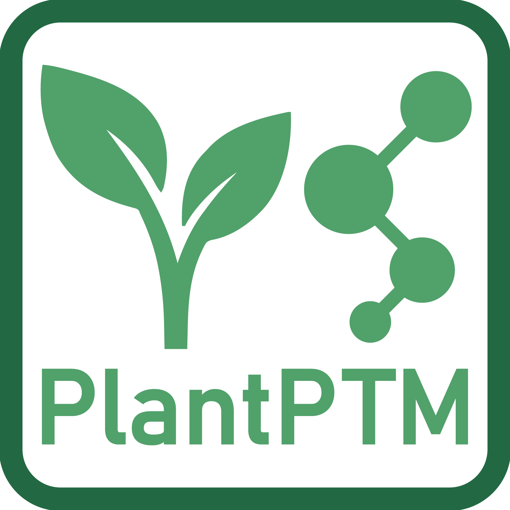

# 

>This is a repository containing source code for paper titled "PlantPTM: Accurate prediction of diverse PTM sites in plant with multi-view deep learning and protein language models".

## Introduction

Post-translational modifications (PTMs) function as molecular switches that play crucial roles in regulating plant growth and development, stress adaptation, and controlling protein degradation. However, mass spectrometry-based techniques remain time-consuming and labor-intensive, and a reliable and cost-effective computational method for predicting plant PTM sites remains lacking. Therefore, to advance PTM studies in plants, we present PlantPTM, an integrated deep learning framework for predicting nine types of plant PTMs, including N-Glycosylation (Ngly), S-Acylation (Sacy), 2-Hydroxyisobutyrylation (Khib), Crotonylation (Kcr), Succinylation (Ksucc), Malonylation (Kmal), Acetylation (Kac), Ubiquitination (Kub), and Phosphorylation (pho). To our knowledge, PlantPTM represents the first computational tool specifically designed for broad, multi-type PTM site prediction across plants. Through independent testing against existing general or plant-specific prediction tools, extensive comparative experiments demonstrated that PlantPTM outperforms existing PTM tools by an average of 42.89%, with 2.90% to 19.08% improvement over the best-performing tools. Moreover, PlantPTM demonstrates robust performance across datasets of varying scales. Notably, PlantPTM can be integrated with AlphaFold3. We used PlantPTM to predict all potential pho sites in the Gα subunit (GPA1) of *Arabidopsis* G proteins, enabling further prediction of G protein structures based on known pho sites. Among the nine PTM types currently supported by PlantPTM, five (Ngly, Sacy, Kcr, Kac, and pho) can be further processed through AlphaFold3 to generate PTM-modified protein structures. The web-server of PlantPTM is freely accessible at [PlantPTM server](https://ai4bio.online/PlantPTM/home/).

## PlantPTM method

### Model architecture

In this work, we propose PlantPTM, a deep learning framework that integrates protein language models with a diverse set of sequence-derived features. The architecture of PlantPTM consists of three core components: 

(i) a multi-encoder module incorporating integration

The multi-encoder module integrates four parallel encoding branches, each engineered to extract complementary feature representations from protein sequences;

(ii) a feature fusion module

The Feature Fusion Module is designed to intelligently integrate multi-modal features derived from all encoder outputs;

(iii) a prediction decoder module

The Prediction Decoder Module operates on the fused feature representation through a sequential three-layer fully connected architecture.

### Requirements

#### Step1

#### Step2

#### Step3

## Descriptions of this repository

1. codes
   - [Dataset.py]: dataset preparation and processing
   - [Generate_PLM_embeddings.py]: generation of full-length protein features
   - [Metrics.py]: validation metrics and additional utils
   - [Model.py]: PyTorch-version PlantPTM model
   - [PlantPTM.py]: for PlantPTM training
   - [Predict.py]: for predicting PTMs using PlantPTM
   - [Threshold.py]: for predicting using PlantPTM with different model thresholds

3. data
   - [fasta]: PTMs dataset clustered with 30% identity
   - [pssm]: compressed file for storing PSSM feature files corresponding to each protein

4. model
   - Please download the pickled models from [PlantPTM server](https://ai4bio.online/PlantPTM/download/).
    
5. case study on GPA1

We predicted all potential pho sites of G α (GPA1) in Arabidopsis G protein using PlantPTM, and further utilized AlphaFold3 to perform structural predictions for Gα-Gβ-Gγ based on experimentally-verified phosphorylation sites in the Gα subunit, displaying the C-terminal domain of all potential phosphorylation sites.

## Citation

## License

This repository is licensed under the terms of the **Apache 2.0** [license](https://github.com/wky0422/PlantPTM/blob/main/LICENSE).
